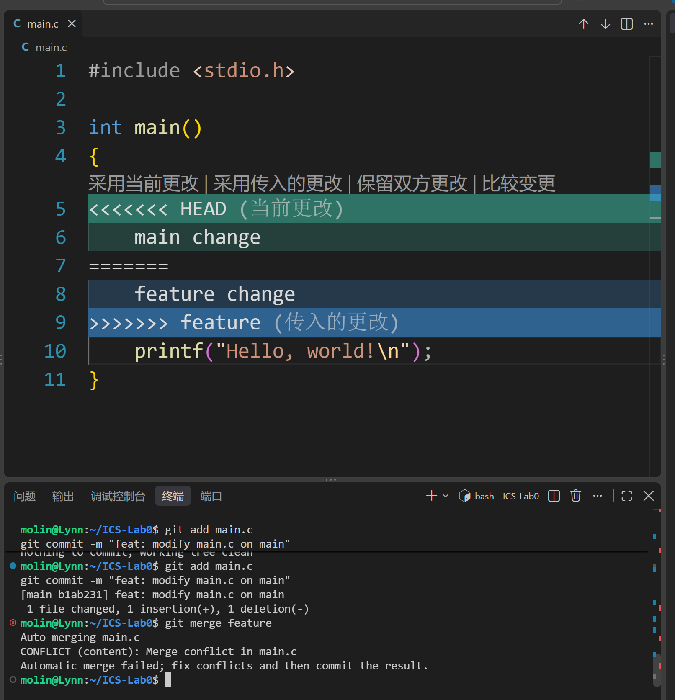
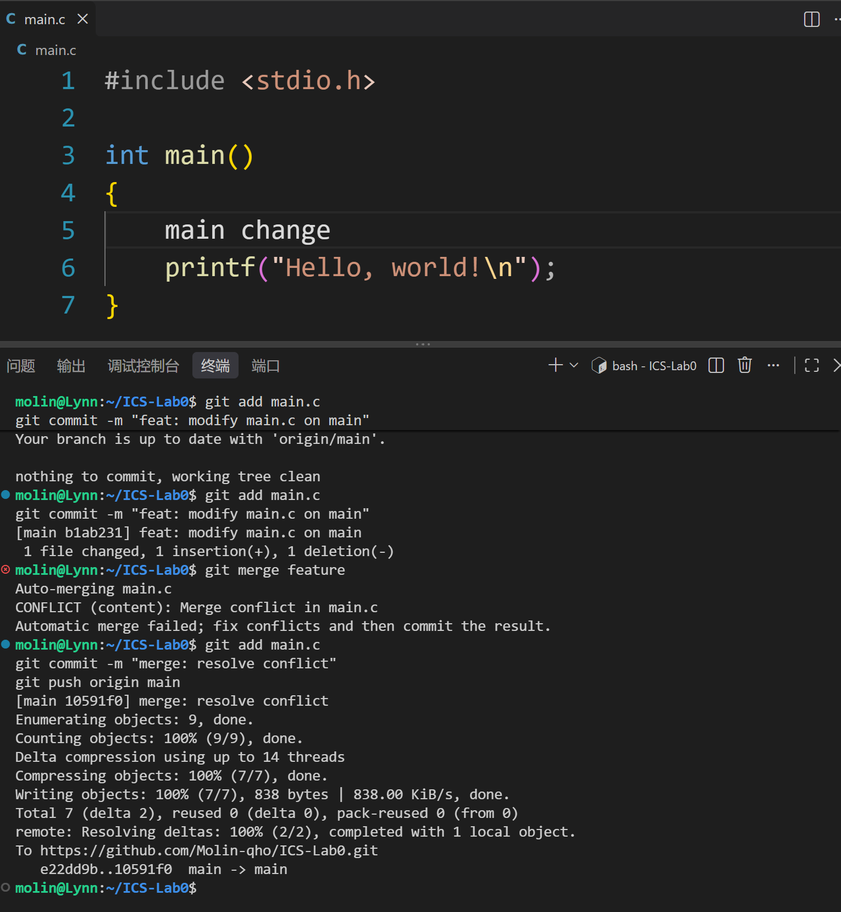

# Lab0 GitLab 实验报告

## 一、文档问题回答（15分）
1. **多人协同经历**：没有多人协作经历
2. **Git 为什么设计“暂存-提交”两步**：暂存区（Staging Area）允许我们精确选择要提交的文件。有时我们改了多个文件，只想提交其中一部分，或者想分多次逻辑清晰的 commit，暂存区就能起到缓冲和分类的作用，避免误提交。
3. **`git branch` 和 `git branch -a` 的区别**：`git branch` 只显示本地分支；`git branch -a` 显示所有分支，包括本地分支和远程分支（remotes/origin/...）。
4. **文章概括与感悟**：
   - **Commit Message 规范**：该文章介绍了社区广泛使用的 Angular Commit Message 规范。一个完整的提交信息包含 Header（必需）、Body（可选）和 Footer（可选）。Header 格式为 `<type>(<scope>): <subject>`，type 用于说明提交类别（如 feat 新功能、fix 修补 bug、docs 文档等）。Body 需详细描述改动动机和前后行为对比，Footer 用于处理不兼容变动或关闭 Issue。符合规范的提交信息不仅便于快速浏览历史、过滤查找信息，还能通过工具自动生成 Change Log。
   - **Git Flow 使用规范**：Gitflow 是一种经典的分支管理策略。它将分支分为两类：永久分支 master（线上环境，最稳定）和 develop（开发环境）；以及临时分支 feature（新功能）、release（测试发布）、hotfix（紧急修复）。新功能从 develop 创建 feature，完成后合并回 develop。测试阶段创建 release，修复完毕后合并到 master 和 develop 并删除。线上 bug 则从 master 创建 hotfix。合并常使用 `--no-ff` 保留分支历史。
   - **为什么要学习 Git**：Git 是现代软件工程的基石。它能帮我们保存历史版本、随时回退、方便多人协作，是每个程序员必须掌握的工具。

## 二、实验步骤
1. 使用模板仓库创建个人仓库，配置本地 git 信息。
2. clone 仓库到本地 WSL，修改 main.c 中的 TODO 并 commit、push。
3. 新建 feature 分支，与 main 分支修改同一行代码，触发 merge 冲突。
4. 解决冲突并提交，最后将实验报告提交到 main 分支。

## 三、冲突解决截图

## 四、实验建议（可选）
无